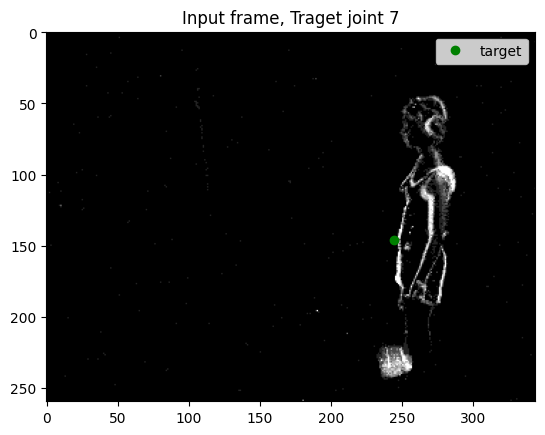
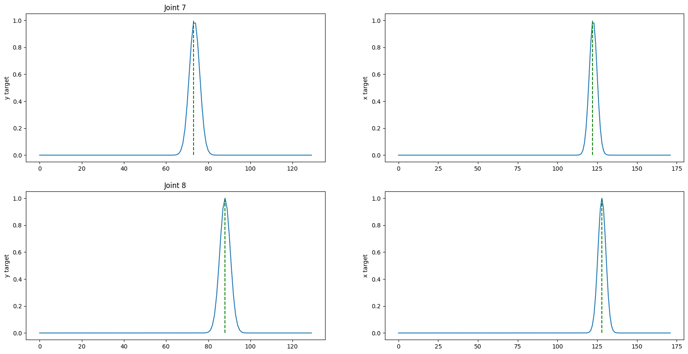

# Minimal lava process tests 
## Requirements
```bash
pip list | grep lava
```
- lava-dl                   0.4.0
- lava-dnf                  0.1.4
- lava-loihi                0.5.0
- lava-nc                   0.8.0
- lava-optimization         0.3.0
```bash
pip list | grep nx
```
- nxcore                    2.4.0

- on `ncl-edu.research.intel-research.net`

## Problem
Running a simple lava process consisting of a dataloader of the DHP19 data.
```python
dataloader = io.dataloader.SpikeDataloader(dataset=complete_dataset)
```
connected to a ring buffer 
```python
gt_logger = io.sink.RingBuffer(shape=target.shape, buffer=num_steps)
dataloader.ground_truth.connect(gt_logger.a_in)
run_condition = RunSteps(num_steps=num_steps)
```


Resulst in an error down the line... even if all ports got the right size/shape.

Running `dataloader_ringbuffer_test.py` fails with the following error message.
Output when running on CPU:
```bash
Loihi2 compiler is not available in this system. This tutorial will execute on CPU backend.
Dataset loaded: 424 samples found
Encountered Fatal Exception: data.shape=(1,) self._shape=(604,) Mismatch
Traceback: 
Traceback (most recent call last):
  File "/homes/glue/lava_env/lib/python3.8/site-packages/lava/magma/runtime/runtime.py", line 95, in target_fn
    actor.start(*args, **kwargs)
  File "/homes/glue/lava_env/lib/python3.8/site-packages/lava/magma/core/model/py/model.py", line 93, in start
    self.run()
  File "/homes/glue/lava_env/lib/python3.8/site-packages/lava/magma/core/model/py/model.py", line 232, in run
    raise inst
  File "/homes/glue/lava_env/lib/python3.8/site-packages/lava/magma/core/model/py/model.py", line 218, in run
    self._cmd_handlers[cmd]()
  File "/homes/glue/lava_env/lib/python3.8/site-packages/lava/magma/core/model/py/model.py", line 387, in _spike
    self.run_spk()
  File "/homes/glue/lava_env/lib/python3.8/site-packages/lava/proc/io/dataloader.py", line 184, in run_spk
    self.ground_truth.send(self.ground_truth_array())
  File "/homes/glue/lava_env/lib/python3.8/site-packages/lava/magma/core/model/py/ports.py", line 492, in send
    csp_port.send(data)
  File "/homes/glue/lava_env/lib/python3.8/site-packages/lava/magma/compiler/channels/pypychannel.py", line 130, in send
    raise AssertionError(f"{data.shape=} {self._shape=} Mismatch")
AssertionError: data.shape=(1,) self._shape=(604,) Mismatch
```

Output when running on Loihi2:
```bash
Running on oheogulch
Dataset loaded: 424 samples found

Encountered Fatal Exception: data.shape=(1,) self._shape=(604,) Mismatch
Traceback: 
Traceback (most recent call last):
  File "/homes/glue/lava_env/lib/python3.8/site-packages/lava/magma/runtime/runtime.py", line 95, in target_fn
    actor.start(*args, **kwargs)
  File "/homes/glue/lava_env/lib/python3.8/site-packages/lava/magma/core/model/py/model.py", line 93, in start
    self.run()
  File "/homes/glue/lava_env/lib/python3.8/site-packages/lava/magma/core/model/py/model.py", line 232, in run
    raise inst
  File "/homes/glue/lava_env/lib/python3.8/site-packages/lava/magma/core/model/py/model.py", line 218, in run
    self._cmd_handlers[cmd]()
  File "/homes/glue/lava_env/lib/python3.8/site-packages/lava/magma/core/model/py/model.py", line 387, in _spike
    self.run_spk()
  File "/homes/glue/lava_env/lib/python3.8/site-packages/lava/proc/io/dataloader.py", line 184, in run_spk
    self.ground_truth.send(self.ground_truth_array())
  File "/homes/glue/lava_env/lib/python3.8/site-packages/lava/magma/core/model/py/ports.py", line 492, in send
    csp_port.send(data)
  File "/homes/glue/lava_env/lib/python3.8/site-packages/lava/magma/compiler/channels/pypychannel.py", line 130, in send
    raise AssertionError(f"{data.shape=} {self._shape=} Mismatch")
AssertionError: data.shape=(1,) self._shape=(604,) Mismatch
```

## DHP19Dataset
Provides an itterable list of input frames and target vectors

```python
complete_dataset = DHP19NetDataset(path=event_data_path, joint_idxs=joint_idxs, cam_id=cam_idxs[0], num_time_steps=seq_length)
input, target = complete_dataset[0]
input.shape # (344, 260, 1) W x H x C x T
target.shape # ((img_widht + img_height)/downsample_factor) * joints (604, )
```

Input frames are np.arrays (np.float32) of shape `(344, 260, 1, 1)` (width, height, channel, time) and target vectora are np.arrays (np.float32) of shape `(604, )`.
The x/y target coordinates for two joints are 1hot encoded as as single vector of 604 elements `[y_joint1(130), x_joint1(172), y_joint2(130), x_joint2(172)]`.


